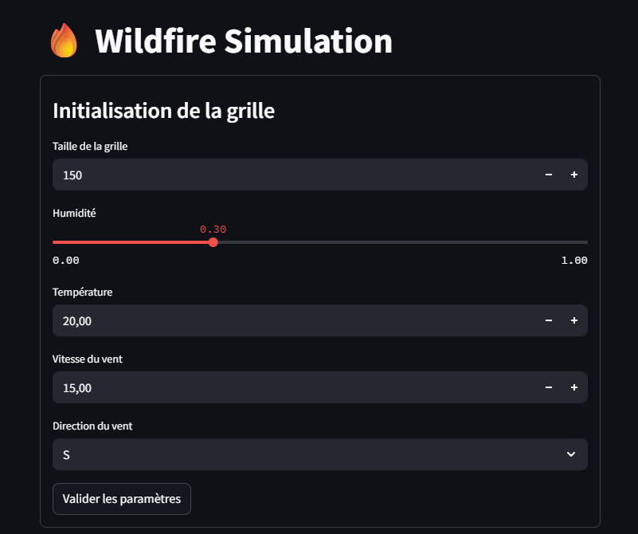
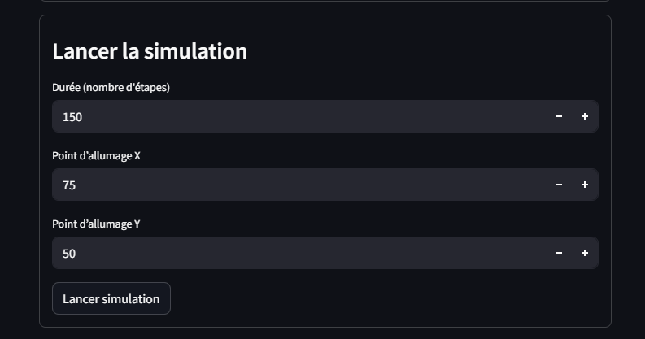
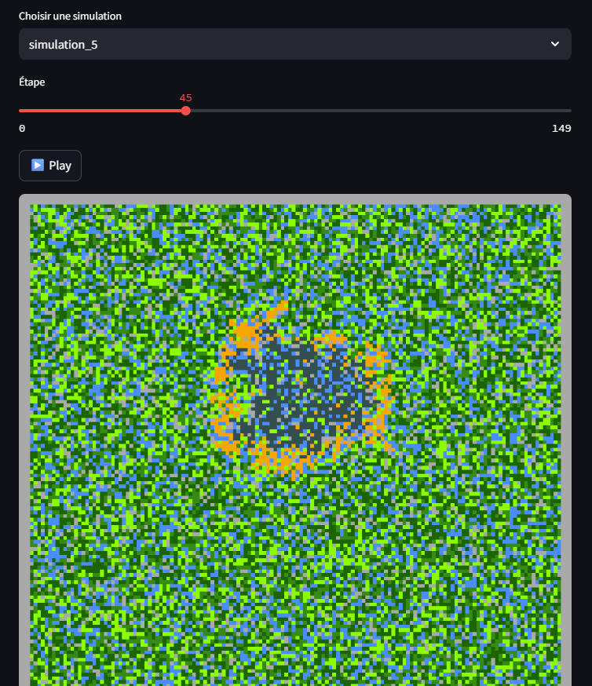

# Wildfire Simulation

This project simulates the spread of a wildfire across a forest grid using a cellular automaton. Each cell can be:

* **Unburned** (green),
* **Burning** (orange),
* **Burned** (dark gray).

The spread depends on environmental conditions such as wind, humidity, and temperature.

---

## Getting Started

### 1. Requirements

#### For the Scala Simulation Backend

* [sbt](https://www.scala-sbt.org/) (Scala Build Tool)
* Java JDK 11 or 17

#### For the Python WebApp

* Python 3.10+
* Required packages listed in [`webapp/requirements.txt`](webapp/requirements.txt)

Install them via:

```bash
pip install -r webapp/requirements.txt
```

---

## Running the Project

### 1. Run the Scala Simulation Server

Inside the `simulation` folder, start the backend:

```bash
sbt run
```
and select the number corresponding to `server`.

Alternatively, use one of the custom `@main` methods in `getStats.scala` to:

* Run a batch of simulations
* Output results to a file
* Perform statistical analysis

### 2. Run the WebApp

Inside the `webapp` folder:

```bash
streamlit run webapp.py
```

This will open the interactive UI in your browser to:

* Set grid size and conditions
* Start a simulation
* Watch it evolve

---

## WebApp Walkthrough

Here are screenshots to guide you through the interface:

### 1. Set simulation parameters and grid size



### 2. Launch the simulation
Be carefull, you need to set a grid before launching the simulation.



### 3. Visualize results
You can select an older simulation in the static folder or watch the last one. You can press the play button to start the simulation and watch it evolve step by step or you can use the slider to jump to a specific step.



### Simulation example
[Watch a video of a simulation](static/simulation.mp4)


